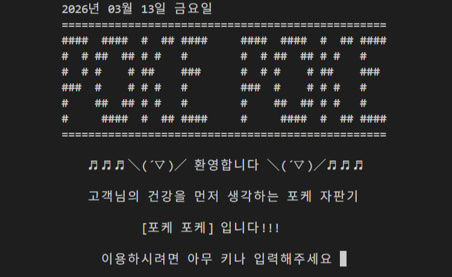
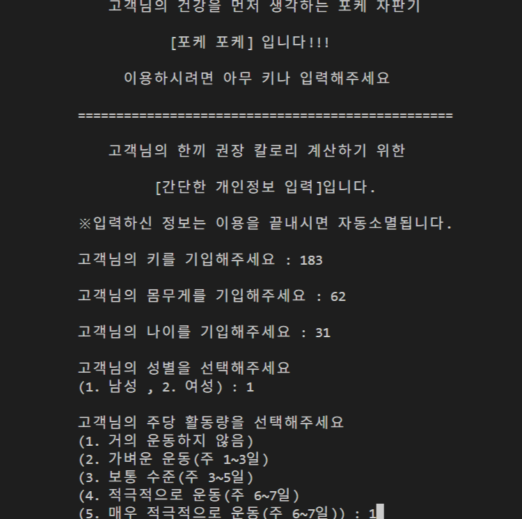
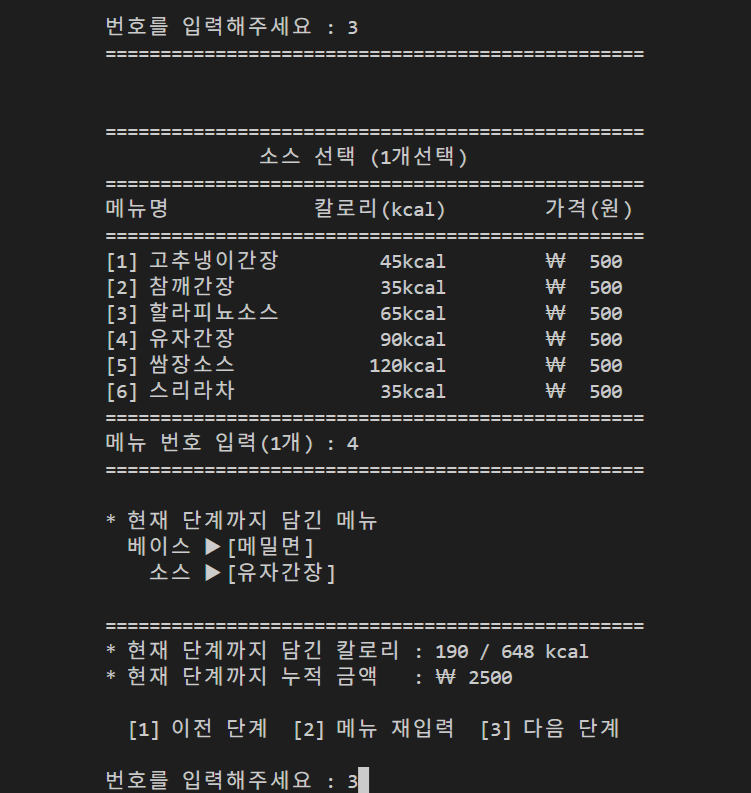
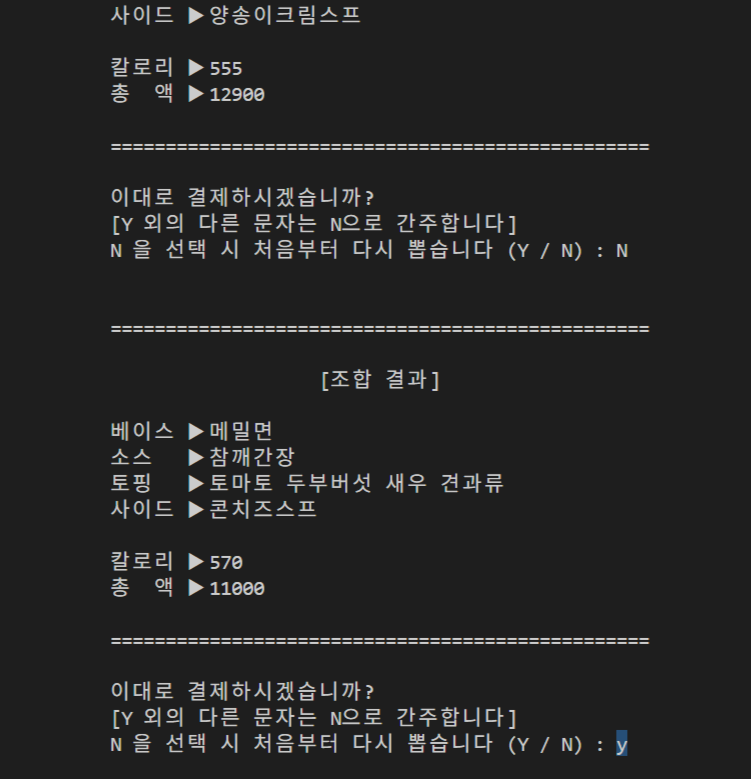
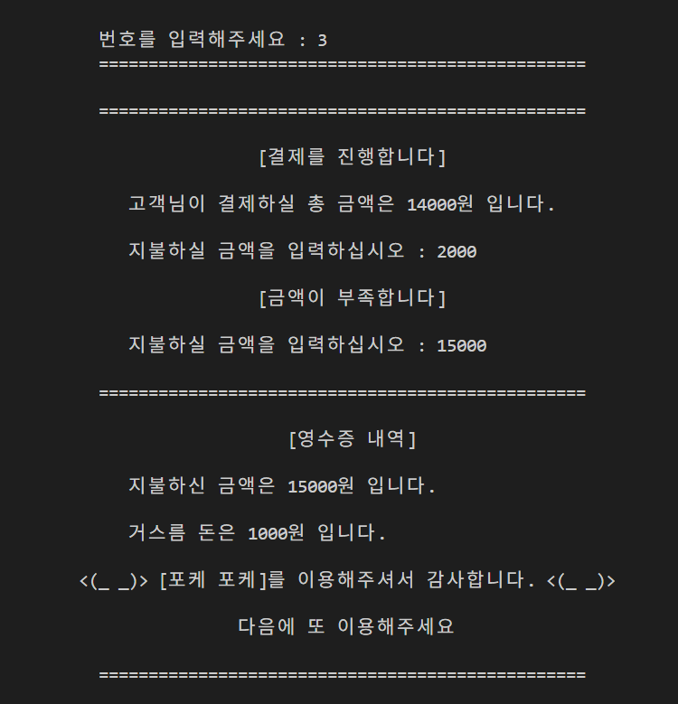
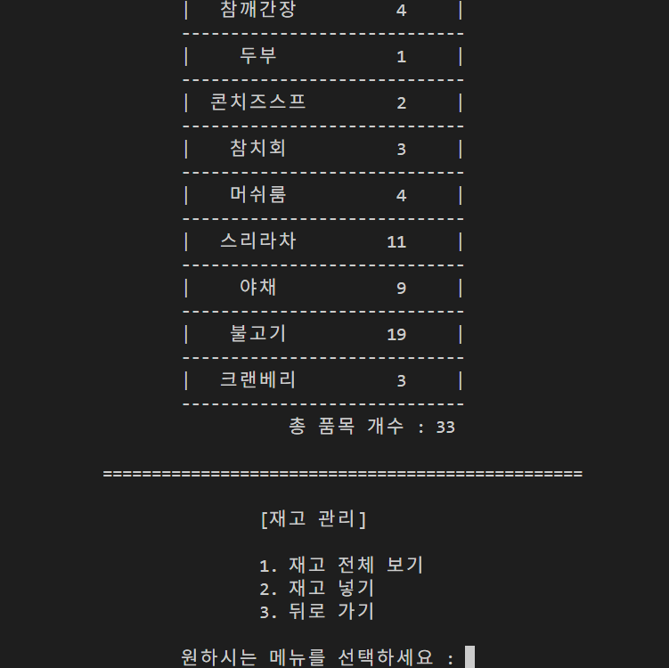
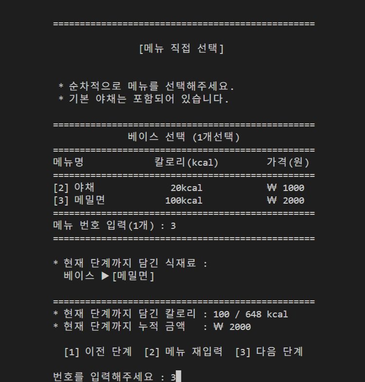
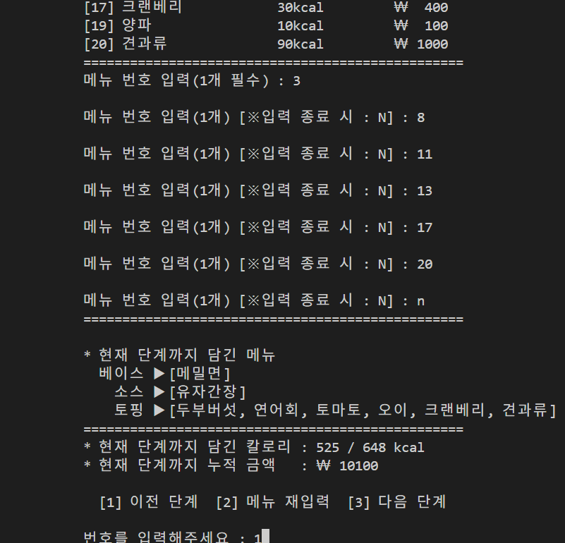

<!-- 소개/기술/기능/스크린샷/실행링크 -->

# 🥗 PokePoke



## 🎯 프로젝트 소개

- Java 를 기반으로 파일 직렬화를 활용한 콘솔 프로그램
- 하루 권장 섭취 칼로리를 고려한 포케 재료 조합 키오스크 프로그램
- 개발 기간: 2024.11.05.-2024.11.25. (11일)
- 개발 인원: 6인

## 📚 사용 기술

- **Language**: Java
- **Tools**: EditPlus

## ✨ 주요 기능

- 개인 정보 수급 및 하루 권장 칼로리 연산 기능
  </br>
- 포케 재료 직접 선택 및 재선택 기능
  </br>
- 포케 재료 랜덤 조합 및 재조합 기능
  </br>
- 결제 및 이용 요일에 따른 할인 기능
  </br>
- 재고 관리 및 메뉴 관리 기능 (관리자 모드)
  </br>

## 👩🏻‍💻 본인 구현 기능

- 포케 재료 직접 선택 기능
  </br>
- 포케 재료 재선택 기능
  </br>

## 📁 파일 구조

```
PokePoke
 ├ settings/
 ├ admin/
 ├ assets/
 ├ IngInfo/
 ├ WebContent/
 ├ ...
 ├ CustomizeMenu.java // 메뉴 직접 조합 관련 java 파일
 ├ ...
 ├ VendingMachine.java // main() 포함 java 파일
 └ README.md
```

## 🚀 실행 방법

### 로컬 실행

Clone the repository and compile the Java files.

```bash
git clone https://github.com/seoyeonum/pokepoke.git
cd pokepoke
javac *.java
java VendingMachine
```
